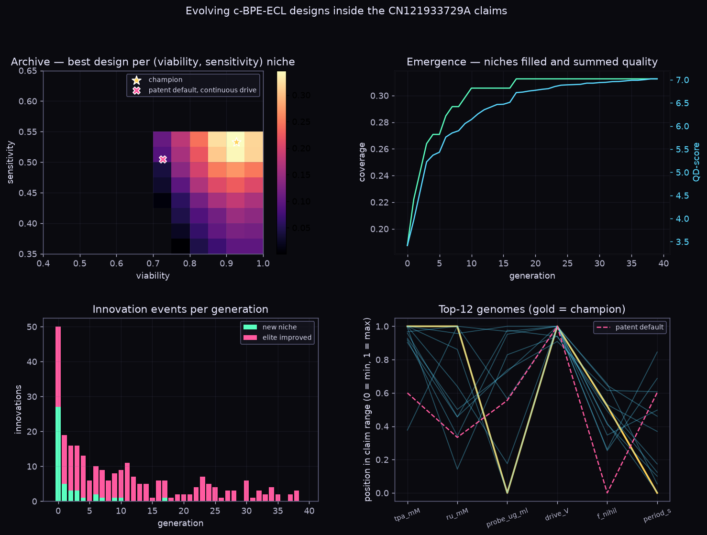

# kgirl.evolve — chaos-driven quality-diversity evolution

`src/kgirl/evolve/` evolves *populations of diverse good solutions*, not one optimum. The result
is a map of trade-offs, and you can trace how the best design emerged.

```
ChaosRNG ──▶ Iso+LineDD variation ──▶ batch evaluate (vectorized) ──▶ MAP-Elites archive
 r = 4 logistic map,                    x' = xᵢ + σ·N + σ_l·N·(xⱼ − xᵢ)        best genome per behavior cell
 arcsine-conjugated to U(0,1)                                                   + lineage (parents, cell, generation)
```

## Why there's no random number generator

Your lab scripts take their noise from deterministic chaos. The engine keeps that rule without
losing statistical quality:

- `u = (2/π)·arcsin(√x)` maps the r = 4 logistic map's invariant density exactly onto U(0,1).
- 64 lanes run in parallel, with decimation and a Weyl rotation to break up correlations.
- Orbits stuck at a fixed point are re-seeded.

Measured over 200,000 draws:

| statistic | measured | ideal |
|---|---|---|
| mean | 0.4999 | 0.5 |
| variance | 0.0831 | 0.0833 |
| lag-1 correlation | 0.002 | 0 |
| normal kurtosis | 3.001 | 3 |

The same seed gives the same evolution, bit for bit.

## Emergence, measured

| metric | meaning |
|---|---|
| coverage | fraction of behavior niches that hold an elite |
| QD-score | summed elite fitness: rewards quality *and* diversity |
| innovations | per generation, how many new niches were discovered and how many elites improved |
| stepping stones | distinct niches visited along the champion's ancestry, i.e. how much the best design depended on detours |

## First problem: c-BPE-ECL assay design (CN121933729A)

```bash
PYTHONPATH=src python -m kgirl.evolve assay -g 40 --plot docs/evolve/figures/assay_run.png
```

**Genome.** Six parameters, all held inside the patent's claim ranges:
- TPA 20–70 mM
- Ru(bpy)₃²⁺ 0.5–2 mM
- probe 25–70 µg/mL
- drive voltage 3.5–5 V
- off ("nihil") fraction 0–0.9
- pulse period 0.5–5 s

**Phenotype.** Two models score each design:
- `nihiline.pulse`: yield, reproducibility, cell viability
- `nihiline.amplification`: predicted CEA and AFP detection limits

**Behavior grid.** Viability × sensitivity.

**Result** (40 generations, about 8 s):
- The patent's preferred recipe under continuous drive scores **0**. Without an off-window the anode fouls and per-pulse reads become irreproducible.
- The champion scores about **0.35**: TPA 70 mM, Ru 2 mM, 5 V, an off-window of about 47 %, fast 0.5 s pulses, about 93 % viable cells.
- The archive maps a hard front. No design reaches sensitivity above about 0.55. Low-viability, high-sensitivity niches stay empty.
- Several elites sit at the *lowest* claimed probe concentration, 25 µg/mL. In this model, nonspecific background grows faster than binding gains. That is a Level 2 prediction worth one wet-lab check, not a conclusion.



## Using it from Claude Code

- The MCP tool `evolve_assay_design` runs the same search.
- The skill `.claude/skills/evolve-designs` explains how to add a new problem: a `Space`, a batched `evaluate`, and two `Descriptor`s that actually vary.

## Tests

```bash
python -m unittest discover -s tests/evolve -t .
```

The tests cover:
- ChaosRNG statistics and determinism
- MAP-Elites coverage on a toy problem
- lineage and reproducibility
- Pareto sorting
- assay evolution beating the baseline while staying inside the claim ranges
