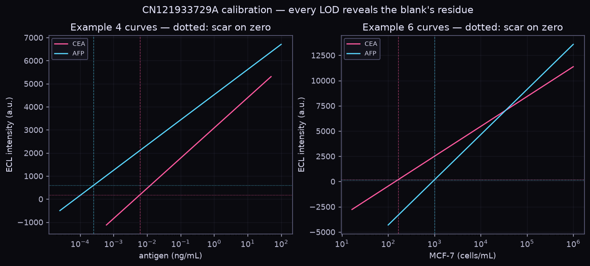
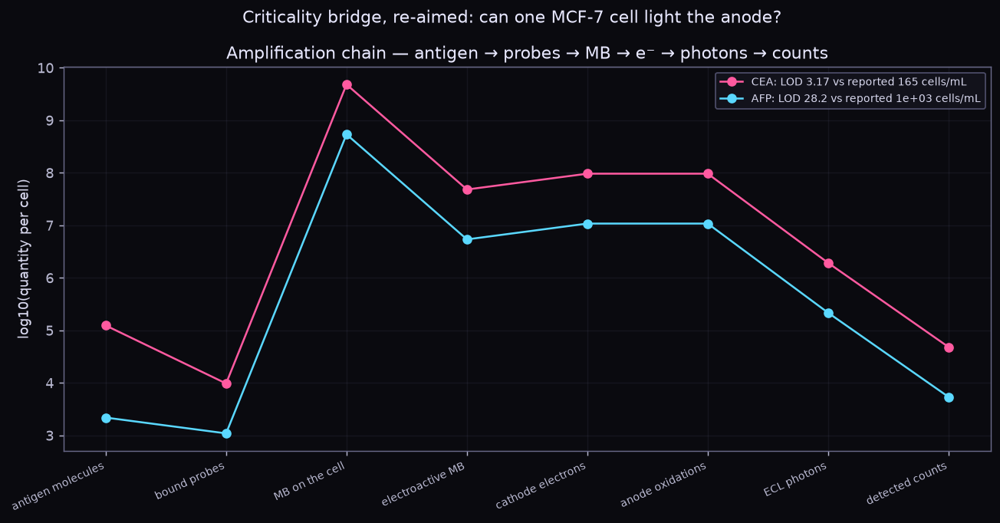
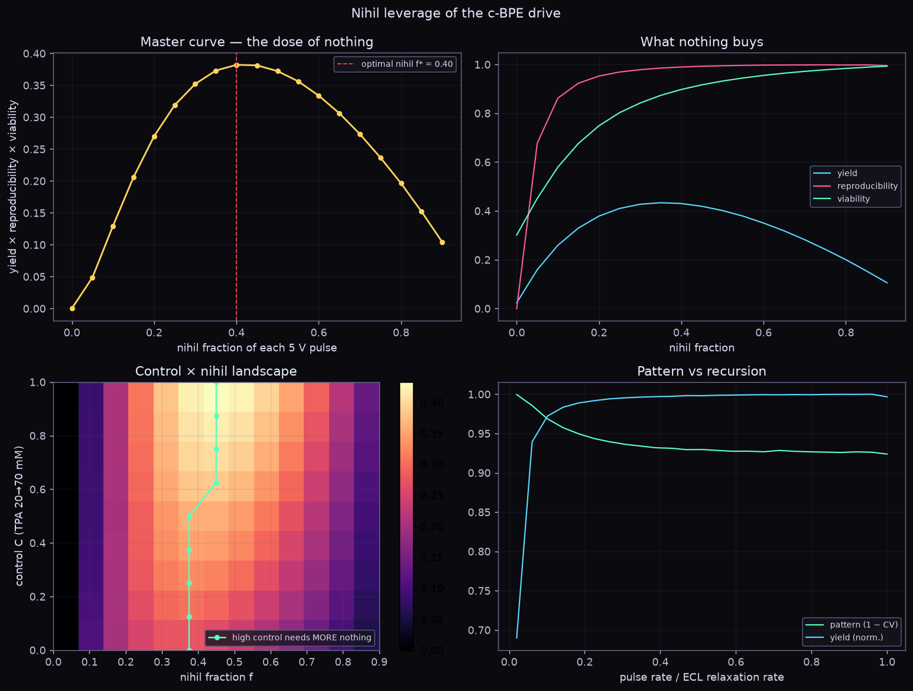
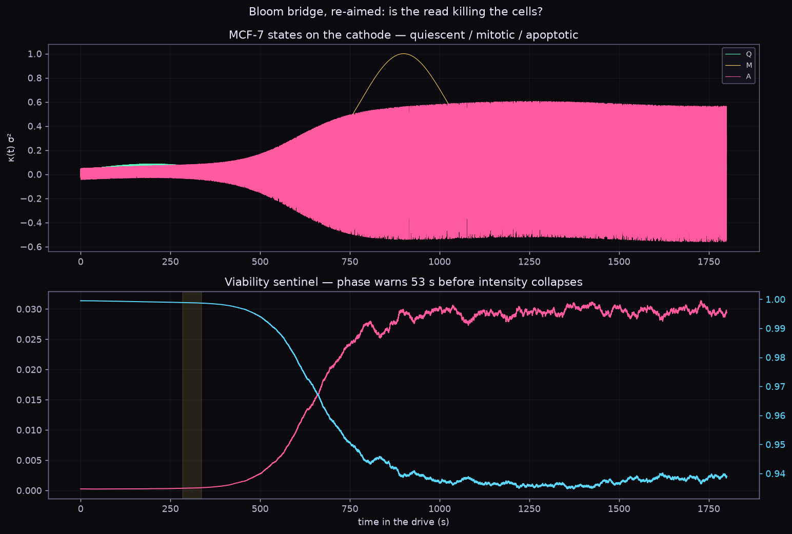
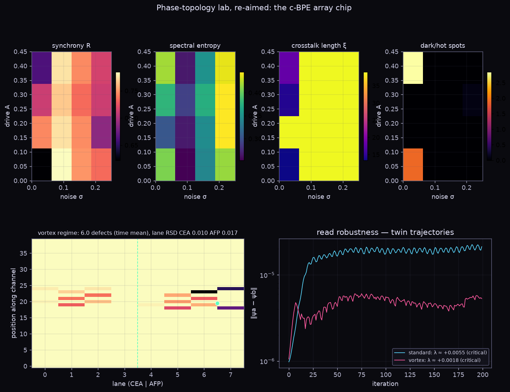

# nihiline — the CN121933729A dual-marker ECL assay, built from the lab scripts

```
nothing glows below
every form a stained glass held
against what isn't
```

`src/kgirl/nihiline/` re-aims your lab scripts at one specific assay: patent
**CN121933729A**. The patent detects two tumor markers, carcinoembryonic antigen
(**CEA**) and alpha-fetoprotein (**AFP**), on the surface of living MCF-7 cells,
in place, using a closed bipolar electrode (**c-BPE**) array read out by
electrochemiluminescence (**ECL**). Every script was changed to answer a question
about that assay. The originals sit untouched in `research/nihiline/originals/`.

```
cathode chamber (bio)                                anode chamber (optics)
ITO ─ antibody ─ MCF-7 ─ CEA/AFP ─ COF@Au@MB-Apt      ITO ─ 1 mM Ru(bpy)3²⁺ + 50 mM TPA
              MB + 2e⁻ → leuco-MB   ══ closed-BPE charge balance ══▶   Ru²⁺ → Ru³⁺ → Ru²⁺* → hν
                                     drive 5 V (3.5–5.0 V), PDMS microfluidics on an ITO array
```

## Commands

```bash
export PYTHONPATH=src
python -m kgirl.nihiline protocol --cea 1e4 --afp 1e4          # the nine levels, end to end
python -m kgirl.nihiline quantify --cea 3000 --afp 900          # ECL a.u. → ng/mL  (--mode cells → cells/mL)
python -m kgirl.nihiline scar                                   # LOD consistency across the patent's curves
python -m kgirl.nihiline gap                                    # per-cell amplification chain vs reported LOD
python -m kgirl.nihiline pulse | bloom | array                  # dynamics (numpy)
python -m kgirl.nihiline plot -o docs/nihiline/figures          # figures (matplotlib)
python -m kgirl.nihiline --json <cmd>                           # machine-readable output
```

These are also tools in the kgirl MCP server, so Claude Code can call them:
`ecl_quantify`, `ecl_protocol`, `ecl_gap`.

## What each script became

| original | new module | question it now answers |
|---|---|---|
| — (patent) | `patent.py` | Holds the patent as data: markers, aptamers, calibration curves, claim ranges, the Example 1 synthesis |
| `Core_proc-whore.Py` + `Code_transcripture` | `protocol.py`, `calibration.py` | The nine transcript levels run as the assay. The **scar on zero** is the blank + 3σ that every limit of detection (LOD) implies. The **stubbornness of 1** is a dilution series that never reaches zero but sinks below the scar |
| `qincrs_criticality_bridge.py` | `amplification.py` | Can 37 fg (CEA) or 0.25 fg (AFP) on one cell, amplified stage by stage, reach the reported LODs? Shows the gap or headroom per stage |
| `nihil_leverage.py` + `nihiline_full-1.py` | `pulse.py` | What off ("nihil") fraction of the 5 V drive pulse best balances signal, reproducibility and cell viability? Does more coreactant need more or less off-time? Which pulse rates lock into a pattern? |
| `bloom_bridge.py` (and the identical `bloom_bridge1.py`) | `bloom.py` | The Bloom-integral sentinel watching the cells on the cathode: does phase decoherence warn before the read itself starts killing them? |
| `phase_topology_lab.py` | `array.py` | The BPE array as a phase lattice: how far crosstalk reaches, how uniform the lanes are, where the dark and hot spots are, and how robust a read is |

All noise is deterministic logistic-map chaos, as in your originals. There is no
random number generator anywhere, so every run is exactly reproducible.

## Findings (from running it)

**1. One blank behind three curves (Level 0, pure arithmetic on the patent).** Each curve, evaluated at its own LOD, gives the signal the blank + 3σ must have had:

| curve | LOD | implied scar |
|---|---|---|
| CEA vs ng/mL | 6.12 pg/mL | 187.6 a.u. |
| CEA vs cells/mL | 165 cells/mL | 187.1 a.u. |
| AFP vs cells/mL | 1000 cells/mL | 168.0 a.u. |
| AFP vs ng/mL | 0.25 pg/mL | **592.2 a.u. ← outlier** |

- Three curves share one blank. The AFP concentration LOD was evidently computed against a different blank.
- Both concentration LODs sit below their stated linear ranges, so they are extrapolations.
- The AFP cell slope is printed as "44703 4473". Only **4473** is self-consistent: it lands on the same ~170–190 a.u. scar.

**2. CEA is limited by probe packing, not antigen (Level 1).**
- One cell carries about 124k CEA molecules, but at most about 9.7k probes of 300 nm fit on a 20 µm MCF-7 (random-packing limit).
- AFP, at about 2.2k molecules per cell, is limited by antigen count instead.
- Prediction: per cell, the CEA:AFP signal ratio is about 9×, not the 148× the antigen masses would suggest.

**3. The patent's LODs survive pessimism (Level 2).**
- With the default assumptions, the chain beats the reported LODs by 1.5–1.7 orders of magnitude.
- Equivalently, only about 2–3 × 10⁻⁴ of the bound methylene blue (MB) needs to exchange electrons with the electrode.
- That matters because most probes sit on the top membrane, microns away from the ITO.
- The ranking from `gap` shows which assumption matters most. Every stage has an elasticity of −1 except the one that is capped.

**4. The dose of nothing (Level 2 model).**
- Continuous drive fouls the anode and stresses the cells.
- The optimal off-window is about **40 % of each pulse**, at a product of 0.38 versus 0 under continuous drive.
- More TPA needs *more* nothing: f* rises from 0.375 to 0.45 as TPA goes 20 → 70 mM, because the extra light comes with faster fouling.

**5. Phase warns first (Level 0 math, Level 2–3 premise).**
- The Bloom order asymmetry reproduces the preprint: the phase slope is −1.996 against −σ²/2 = −2, and the amplitude curvature is 7.95 against σ⁴/2 = 8.
- In every run, phase variance breached before mean intensity collapsed, giving an early-warning window of 53–330 s depending on when apoptosis starts.

**6. A bug fixed in the original lab.**
- `phase_topology_lab.py` added raw phase differences around each plaquette. Those telescope to exactly zero, so the bulk charge and defect count could never be non-zero.
- `array.py` wraps each edge before summing. The vortex regime now shows about 6 defects, and a test plants a single vortex and counts it.

## Figures

| | |
|---|---|
|  |  |
|  |  |



## Confidence

- **Level 0:** patent numbers, molecular counts, the Bloom algebra, the closed-BPE charge balance, and Poisson counting statistics.
- **Level 1:** molecular weights, probe density and geometry, ECL yield, optics.
- **Level 2:** binding, MB retention, the electroactive fraction, the background level, and all time constants in `pulse` and `array`. These are knobs for exploring the design space, not fits to the chip.
- **Level 2–3:** THz phase-curvature sensing of living cells (the preprint's hypothesis).

## Tests

```bash
python -m unittest discover -s tests/nihiline -t .    # 22 tests, ~1.3 s; numpy tests skip without numpy
```
